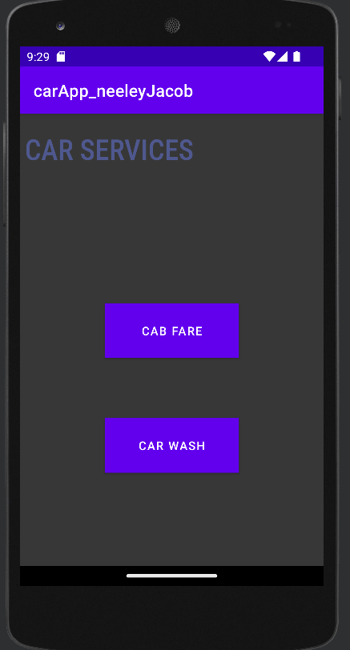
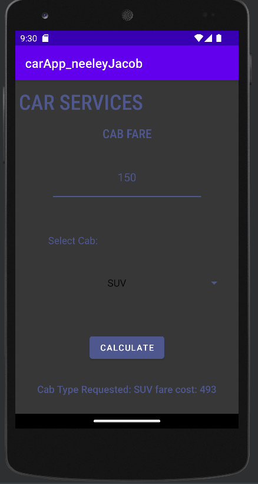
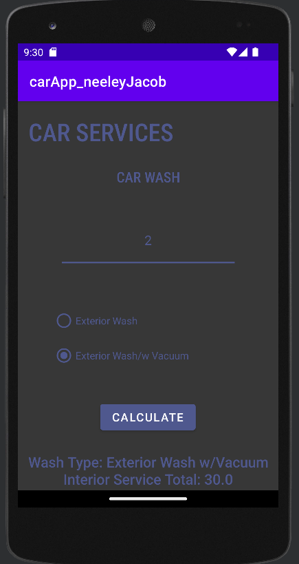

# CarServices_AndroidApp

## About
Simple android studio project.  
User can enter numerical values and select different product categories using a spinner and radio buttons 
User can access different services from the main page. "MainActivity" acts as a landing page, each button will take the user to another screen with different services.

### Main Files:

#### XML Files
- Found in app/src/main/res/layout/

#### Java Files
- Found in app/src/main/java...

## Screens:

